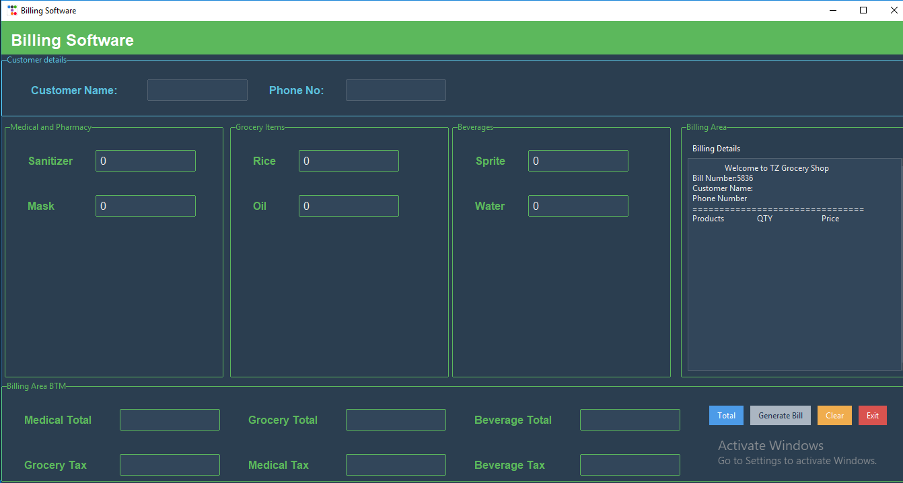

# Billing Software 📜

Billing Software is a Python GUI project using Ttk Bootstrap.

## Screenshot



## Features 

- Add Customer Name, Mobile
- Generate Tax
- Generate Bill and 
- Output as bill.txt

## Installation ✨

Use the package manager [pip](https://pypi.org/project/ttkbootstrap/) to install ttkbootstrap.

```bash
pip install ttkbootstrap
```

## Usage 🔧

```python
# import ttkbootstrap
from tkinter import *
import ttkbootstrap as tb

```

## Contributing 🤘

Pull requests are welcome. For major changes, please open an issue first
to discuss what you would like to change.

Please make sure to update tests as appropriate.

## License

[MIT](https://choosealicense.com/licenses/mit/)
